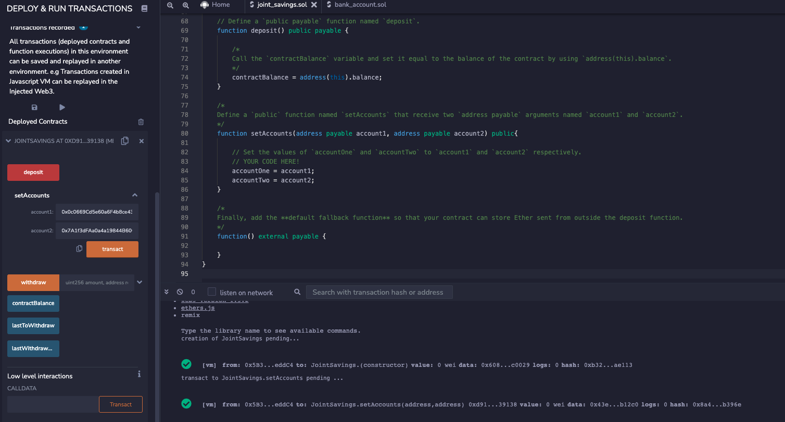
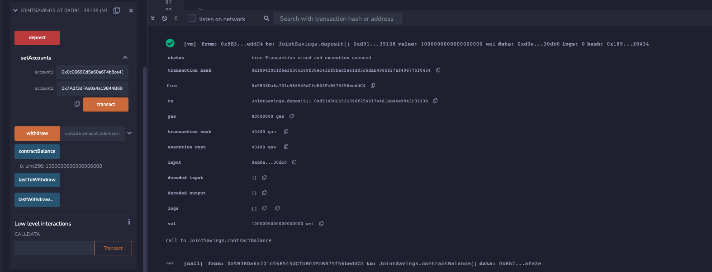
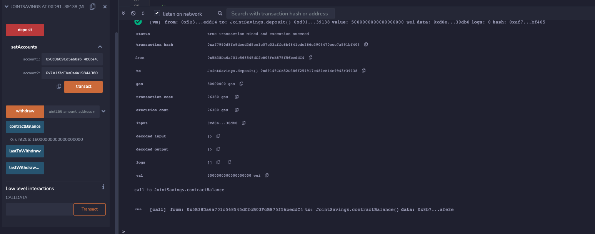
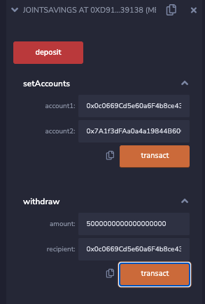
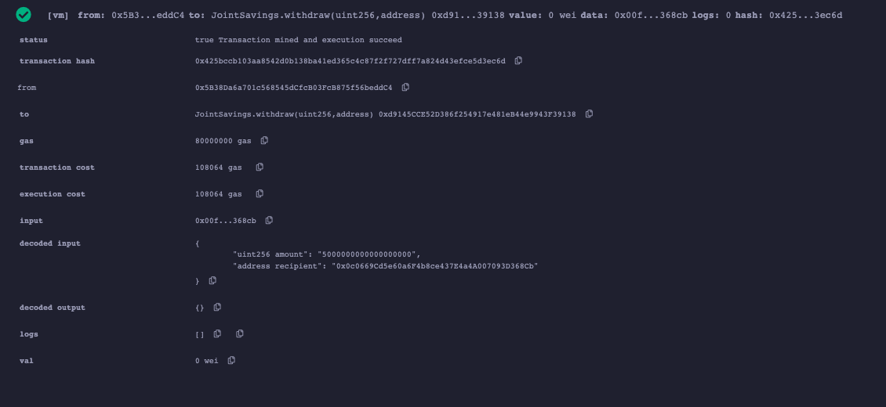
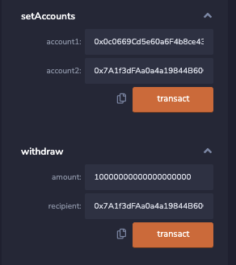
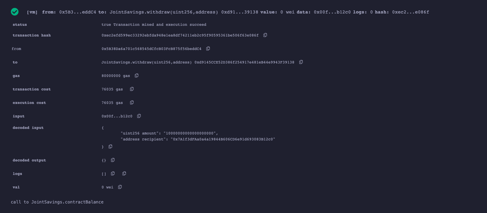

# Unit 20 - "Joint Savings Account"

In this assignment, I have created a joint savings accounts using Solidity. Below is a demonstration of how this program works.

## Account setup

## Transaction 1: Send 1 Ether as Wei

## Transaction 2: Send 10 Ether as Wei

## Transaction 3: Send 5 Ether

## Withdraw 5 ETH to Account 1

## Withdraw 10 ETH to Account 2

---

© 2021 Trilogy Education Services, a 2U, Inc. brand. All Rights Reserved.

